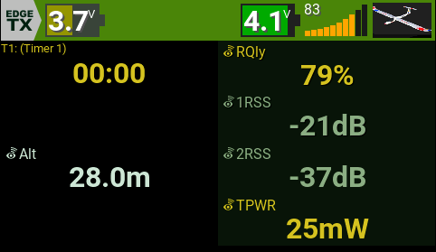

# EdgeTX Widgets: LinkMeter & BattMeter

Widgets for EdgeTX (2.10.2 or similar).

## Screenshot

---

## LinkMeter

A graphical representation of the quality of your connection.  
It combines **`RQly`** and **`RSSI`** into a single visual indicator.

**Features**:
- Horizontal bars (left to right, increasing height)
- **Number of bars is fully configurable**
- Color thresholds for low, medium, and high signal quality are configurable
- Automatically selects and combines the best available signal sources:
  1. **`RQly`**
  2. Average of **`1RSS`** and **`2RSS`**
  3. **`RSSI`**

**Options**:

| Name        | Type  | Description                               | Default   |
|-------------|-------|-------------------------------------------|-----------|
| ShowPercent | BOOL  | Show **`RQly`** + **`RSSI`** mix           | 1         |
| Text        | COLOR | Font color                                | White     |
| Shadow      | COLOR | Font-Shadow color                         | Gray      |
| BarCount    | VALUE | Number of bars (5–20)                     | 10        |
| BarColor    | COLOR | Bar color when signal is empty            | Gray      |
| Low         | COLOR | Bar color for low signal                  | Red       |
| Medium      | COLOR | Bar color for medium signal               | Orange    |
| High        | COLOR | Bar color for high signal                 | Green     |

---

## BattMeter

A graphical representation of your transmitter or receiver battery status.  
It can display either:

- **TX battery voltage** (**`tx-voltage`**) – default
- **RX battery voltage** (**`RxBt`**)

**Options**:

| Name       | Type   | Description                                                   | Default   |
|------------|--------|---------------------------------------------------------------|-----------|
| tx_voltage | BOOL   | TX battery voltage **`tx-voltage`** (1) or RX battery **`RxBt`** (0) | 1         |
| Cells      | VALUE  | Number of cells (1–8)                                         | 2         |
| PerCell    | BOOL   | Show voltage per cell (1) or total voltage (0)                | 1         |
| Text       | COLOR  | Voltage text color                                            | White     |
| Shadow     | COLOR  | Voltage text shadow color                                     | Dark gray |
| BatColor   | COLOR  | General color of the battery                                  | Dark gray |
| Full       | COLOR  | Bar color for 80–100% battery                                 | Green     |
| High       | COLOR  | Bar color for 60–79% battery                                  | Olive     |
| Medium     | COLOR  | Bar color for 40–59% battery                                  | Yellow    |
| Low        | COLOR  | Bar color for 20–39% battery                                  | Orange    |

---

